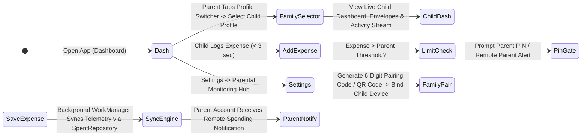

# Spent — Android Design Spec & Technical Reference (Kotlin / MVI)

> **Core Concept:** An offline-first personal & family budgeting Android app built in Kotlin & Jetpack Compose using MVI architecture and the Repository Pattern. Features 3 core tabs (Dashboard, Analytics, Settings), pay-cycle envelope tracking, zero-friction expense logging (< 3s), background WorkManager for recurring payments, Google OAuth account management, multi-profile **Parental Account Monitoring**, Google Drive cloud sync, and customizable CSV/Excel data exports.

---

## 1. Architecture & Android Tech Stack

| Component | Technology / Specification |
|---|---|
| **Language** | Kotlin 2.x |
| **UI Framework** | Jetpack Compose (Material 3, Navigation Compose, Compose Animations) |
| **Architecture** | **Pure MVI (Model-View-Intent) + Repository Pattern** (`UiState`, `UiIntent`, `UiEffect`, `SpentRepository`) |
| **Authentication** | **Google OAuth 2.0 via Android Credential Manager API** (`androidx.credentials`) |
| **Family Sync & Monitoring** | Encrypted Cloud Sync Engine (Google Drive / Firebase) + Family Pairing Protocol |
| **Security & Controls** | **Android BiometricPrompt API** + `EncryptedSharedPreferences` for Parent PIN verification |
| **Local Database** | Room Database (SQLite) with multi-profile family support |
| **Preferences** | Jetpack DataStore for walkthrough & preference flags |
| **Background Tasks** | **Android WorkManager** (`PeriodicWorkRequest` for recurring payments & family telemetry sync) |
| **Async & Flow** | Kotlin Coroutines + `StateFlow` / `SharedFlow` |
| **Image Loading** | Coil (Profile avatars, receipt attachments & category icons) |
| **Charts** | Vico Charts for Compose / Custom Canvas |
| **Data Export & Cloud** | Storage Access Framework (SAF) + **Google Drive Backup Sync** + Customizable CSV & Excel (`.xlsx`) Exporters |

### MVI Architecture Contract
- **`UiState` (Model):** Immutable data class representing complete UI state (including active profile, child telemetry, and parental restrictions).
- **`UiIntent` (Intent):** User actions emitted from UI to ViewModel (e.g., `AddExpenseClicked`, `SwitchFamilyProfile(childId)`, `SetChildAllowance(childId, amount)`, `VerifyParentalPin(pin)`).
- **`UiEffect` (Side-Effect):** Single-shot events emitted from ViewModel to UI (e.g., `ShowToast`, `NavigateTo`, `VibrateHaptic`, `PromptBiometric`).
- **`ViewModel`:** Accepts `UiIntent` → invokes Repository use-cases via Coroutines → updates `UiState` via `MutableStateFlow` → emits `UiEffect` via `Channel`/`SharedFlow`.

### 🗄️ Repository Pattern Data Architecture
The app enforces the **Repository Pattern** as the single source of truth for all data access:
- **`SpentRepository` (Interface):** Defines reactive data contracts exposing Kotlin `Flow<T>` streams for entities (`getTransactionsFlow()`, `getCategoriesFlow()`, `getPayCycleFlow()`, `getFamilyMembersFlow()`).
- **`SpentRepositoryImpl` (Implementation):** Coordinates local Room DAOs, Jetpack DataStore preferences, and the background cloud/family sync engine.
- **Decoupling:** ViewModels and Compose UI components never interact directly with Room DAOs or cloud APIs; all data operations route cleanly through `SpentRepository`.

---

## 2. Navigation Shell — 3 Core Tabs

```
┌────────────────────────────────────────────────────────┐
│                      SPENT APP                         │
├────────────────────┬──────────────────┬────────────────┤
│    🏠 Dashboard    │   📊 Analytics   │  ⚙️ Settings   │
└────────────────────┴──────────────────┴────────────────┘
```

1. **🏠 Dashboard Tab:** Balance overview, `Safe to Spend Today` metric, hero CTA buttons (`+ Add Expense`, `+ Add Income`), Category Envelope horizontal row, Recent Activity feed, and **Family Profile Selector** (allows parents to switch view to any linked child account).
2. **📊 Analytics Tab:** Category spending distribution donut chart, daily spending trends per cycle, and income vs expense comparisons (filterable per family member).
3. **⚙️ Settings Tab:** Account & Family Profile Manager (Google OAuth), **Parental Monitoring Hub** (Pair Child Device, Set Allowances, Remote Category Locks), Pay Cycle config, Category Manager, Data Export & Google Drive Sync, Theme toggle, Currency selector.

---

## 3. Family Pairing & Parental Monitoring User Flow



### 👨‍👩‍👧 Family Account Architecture
- **Account Roles:**
  - 👨‍💼 **Parent / Supervisor Account:** Full control over own budget + remote real-time visibility into all linked children's accounts. Can set envelope allowances, category locks, and spending limits remotely.
  - 👧 **Child Account:** Clean, age-appropriate envelope budgeting UI on the child's device. Logs expenses locally while automatically syncing transactions and envelope state to the Parent Account.
- **Family Pairing Protocol:**
  - Parent generates a secure 6-digit `FamilyPairingCode` or QR code in Settings.
  - Child inputs code on setup, binding their device to the Parent's account via encrypted cloud sync.
- **Remote Parental Control Features:**
  - **Live Remote Dashboard Inspection:** Parents switch profiles directly on their own Dashboard header to view any child's balance, envelope progress, and transaction feed in real time.
  - **Remote Envelope Allocation & Allowance:** Parent assigns monthly/weekly allowances into specific child envelopes (e.g. $50 Groceries, $30 Entertainment).
  - **Remote Category Locking:** Parent can lock specific categories (e.g. "Savings" or "Games") preventing child from spending out of them without Parent PIN approval.
  - **Real-Time Over-budget Push Notifications:** Parent gets alerted on their device whenever a child logs a transaction exceeding defined threshold limits or overspends an envelope.

---

## 4. Screen Specifications

### 🏠 1. Dashboard Screen (`DashboardScreen.kt`)
*Built as a single unified `LazyColumn` to eliminate nested scrolling.*

- **Header Balance Card & Profile Switcher:** Displays active profile avatar (Parent vs Child selector chip), Cycle label, Total Income, Total Spent, and Net Balance. Parents can tap the profile switcher to instantly view any linked child's dashboard.
- **Pay Cycle Metrics Badge:** *"Cycle ends in X days"* chip + `Safe to Spend Today` indicator.
- **Hero Actions:** Prominent buttons for `+ Add Expense` (keypad modal trigger) and `+ Add Income` (Parent only / Child allowance trigger).
- **Category Envelopes Horizontal Row (`LazyRow`):** Horizontal scrollable cards displaying category icon, name, spent vs budget, remaining balance, color-coded progress fill, and a 🔒 Lock Badge if category is locked by Parent.
- **Recent Activity Feed (`items` block in `LazyColumn`):** Integrated recent transactions list grouped by date header. Displays category icon, note/merchant, payment tag, signed amount (`-$X` red / `+$X` green), and `SwipeToDismissBox` deletion with snackbar undo. Includes auto-logged recurring payment indicators.

### ➕ Modal Keypad (`TransactionBottomSheet.kt`)
- Custom 4x4 calculator keypad (`+`, `−`, `×`, `÷`) with live mathematical readout.
- Horizontal category pill selector (`LazyRow`), date/time picker, merchant/note field, photo receipt attachment (Coil / Camera), and optional recurring payment rule toggle.
- **Parental PIN / Allowance Intercept:** If selected category is parent-locked or amount exceeds child allowance threshold, prompts for Parent PIN (local) or sends a remote approval request to the Parent's device.

### 📊 2. Analytics Screen (`AnalyticsScreen.kt`)
- **Profile Filter:** Toggle between Parent budget analytics and individual linked Child spending reports.
- **Category Distribution:** Donut chart showing category spending allocation.
- **Daily Spending Velocity:** Day-by-day spending bar chart highlighting spending spikes.
- **Income vs Expense Trend:** Multi-cycle comparison bar chart.

### ⚙️ 3. Settings Screen (`SettingsScreen.kt`)

#### 👤 Account & Family Profile Manager (Google OAuth)
- **Profile Header:** Displays Google user profile avatar (via Coil), display name, email, and Account Role (Parent / Child).
- **Google OAuth Sign-In:** Android Credential Manager Google Sign-In flow (`androidx.credentials`).
- **Cloud & Family Sync Status:** Indicator showing Google Drive / Cloud Sync state and last telemetry sync timestamp.

#### 🛡️ Parental Monitoring Hub (Parent Mode)
- **Linked Children Manager:** List of linked child accounts showing device name, last sync timestamp, and status. Button to **"Pair New Child Device"** (generates 6-digit code / QR code).
- **Remote Allowance & Limit Manager:** Set maximum single-expense limits and daily/weekly allowance deposits for each child.
- **Remote Category Locking:** Toggle locks on individual category envelopes per child account.
- **Master Parent PIN & Biometric Security:** Master 4/6-digit PIN + `BiometricPrompt` protection for sensitive parent actions (Settings, Budget edits, Data Reset).

#### ⚙️ General & Data Settings
- **Pay Cycle Config:** Edit pay frequency (Weekly, Bi-weekly, Semi-monthly, Monthly) and cycle start date.
- **Category Manager:** Add, edit, reorder, recolor, and set target budget limits per category.
- **Data Center:** Customizable CSV/Excel export generator, Google Drive cloud backup sync, JSON backup/restore, App Data Reset.

---

## 5. Account Auth, Family Sync & Parental Monitoring Specs

### 👨‍👩‍👧 Family Cloud Sync Engine
- **Architecture:** Encrypted telemetry payloads synced via Google Drive App Data / Firebase Cloud Messaging through `SpentRepository`.
- **Background Sync:** `FamilyTelemetrySyncWorker` runs periodically via `WorkManager` to push child transaction deltas and pull updated parent rules/allowances.
- **Privacy & Security:** All child telemetry payloads encrypted using AES-256 with the shared `FamilyPairingToken`.

### 🛡️ Parental Control Security Specification
- **Security Engine:** Master Parent PIN encrypted using Android Keystore System via `EncryptedSharedPreferences`.
- **Biometric Integration:** Uses `BiometricPrompt` with `BIOMETRIC_STRONG` or `DEVICE_CREDENTIAL` fallbacks.
- **PIN Gate Dialog Component (`ParentalPinDialog.kt`):** A reusable Jetpack Compose modal dialog that intercepts protected user intents (`UiIntent`) until PIN/Biometric verification succeeds.

### 📄 Customizable CSV / Excel Exports
Exports are created via Storage Access Framework (SAF) and can be saved locally or uploaded directly to **Google Drive**. **The user can choose which columns to include** (and filter by family member) prior to export.

| Available Column | Format / Example | Description |
|---|---|---|
| `transaction_id` | `UUID string` | Unique record identifier |
| `family_member_name` | `Child Profile (Leo)` | Associated family profile name |
| `timestamp_iso` | `2026-08-11T20:45:00Z` | Standard ISO-8601 timestamp |
| `date` | `2026-08-11` | Localized YYYY-MM-DD date |
| `time` | `20:45:00` | Localized HH:MM:SS time |
| `type` | `EXPENSE` \| `INCOME` | Transaction class |
| `amount` | `14.50` | Numerical amount |
| `category_name` | `Groceries` | Resolved category envelope name |
| `merchant_note` | `Supermarket` | Merchant description or notes |
| `pay_cycle_id` | `UUID string` | Associated pay cycle ID |

---

## 6. Room Database Schema (Kotlin)

```kotlin
@Entity(tableName = "user_account")
data class UserAccountEntity(
    @PrimaryKey val id: String = "primary_account",
    val googleId: String?,
    val displayName: String?,
    val email: String?,
    val photoUrl: String?,
    val role: String = "INDEPENDENT", // "PARENT", "CHILD", "INDEPENDENT"
    val activeProfileId: String = "primary_account",
    val isSignedIn: Boolean = false,
    val lastDriveSyncTimestamp: Long = 0L
)

@Entity(tableName = "family_members")
data class FamilyMemberEntity(
    @PrimaryKey val id: String = UUID.randomUUID().toString(),
    val displayName: String,
    val photoUrl: String? = null,
    val role: String, // "PARENT", "CHILD"
    val pairingCode: String? = null,
    val isLinked: Boolean = false,
    val maxSingleExpenseLimit: Double? = null,
    val lastSyncTimestamp: Long = 0L
)

@Entity(tableName = "parental_control_config")
data class ParentalControlConfigEntity(
    @PrimaryKey val id: String = "primary_config",
    val isEnabled: Boolean = false,
    val masterPinHash: String? = null,
    val isBiometricEnabled: Boolean = false,
    val protectSettings: Boolean = true,
    val protectDataReset: Boolean = true
)

@Entity(tableName = "categories")
data class CategoryEntity(
    @PrimaryKey val id: String = UUID.randomUUID().toString(),
    val ownerProfileId: String = "primary_account", // Links to FamilyMember or primary User
    val name: String,
    val iconName: String,
    val colorHex: String,
    val budgetAmount: Double,
    val displayOrder: Int,
    val isParentalLocked: Boolean = false
)

@Entity(tableName = "pay_cycles")
data class PayCycleEntity(
    @PrimaryKey val id: String = UUID.randomUUID().toString(),
    val ownerProfileId: String = "primary_account",
    val frequency: String, // "WEEKLY", "BIWEEKLY", "SEMIMONTHLY", "MONTHLY"
    val startDate: Long,
    val income: Double
)

@Entity(
    tableName = "transactions",
    foreignKeys = [
        ForeignKey(
            entity = CategoryEntity::class,
            parentColumns = ["id"],
            childColumns = ["categoryId"],
            onDelete = ForeignKey.CASCADE
        )
    ]
)
data class TransactionEntity(
    @PrimaryKey val id: String = UUID.randomUUID().toString(),
    val ownerProfileId: String = "primary_account", // Distinguishes parent vs child entries
    val amount: Double,
    val type: String, // "EXPENSE", "INCOME"
    val categoryId: String,
    val payCycleId: String? = null,
    val timestamp: Long,
    val note: String,
    val merchantName: String? = null,
    val imageUri: String? = null,
    val recurringRuleId: String? = null
)

@Entity(tableName = "recurring_rules")
data class RecurringRuleEntity(
    @PrimaryKey val id: String = UUID.randomUUID().toString(),
    val ownerProfileId: String = "primary_account",
    val amount: Double,
    val categoryId: String,
    val frequency: String, // "DAILY", "WEEKLY", "MONTHLY"
    val startDate: Long,
    val endDate: Long? = null
)
```

---

## 7. Implementation Roadmap

| Phase | Deliverables |
|---|---|
| **Phase 1 — MVI Architecture & Repository Layer** | Navigation Compose shell (3 tabs), MVI base contract (`UiState`, `UiIntent`, `UiEffect`), Repository Pattern layer (`SpentRepository` / `SpentRepositoryImpl`), Room Database (`UserAccount`, `FamilyMember`, `ParentalControlConfig`, `PayCycle`, `Category`, `Transaction`), DataStore, Material 3 Theme. |
| **Phase 2 — Walkthrough & Starter Data** | Spotlight overlay component, starter categories Room seed data via `SpentRepository`, DataStore preference flag. |
| **Phase 3 — Dashboard & Keypad Modal** | `DashboardScreen` UI with horizontal envelope `LazyRow`, balance header, profile switcher chip, `Safe to Spend` badge, custom 4x4 keypad modal, transaction MVI & Repository pipeline. |
| **Phase 4 — Activity Feed & Background Worker** | Integrated activity list on Dashboard with `SwipeToDismissBox` deletion, `WorkManager` (`RecurringTransactionWorker`) background recurring execution via `SpentRepository`. |
| **Phase 5 — Google OAuth & Parental Monitoring Hub** | Google Sign-in with Credential Manager API (`androidx.credentials`), Master PIN & BiometricPrompt setup, `ParentalPinDialog.kt`, family pairing protocol, remote category lock flags. |
| **Phase 6 — Family Cloud Telemetry & Drive Backup** | `FamilyTelemetrySyncWorker` background cloud sync for child telemetry, SAF document exporter for customizable CSV and `.xlsx` (with family filters), Google Drive Cloud backup auto-sync. |
| **Phase 7 — Analytics & Polish** | `AnalyticsScreen` with profile filtering, category donut breakdown, daily trend bars, income vs expense chart, receipt attachments, dark/light theme polish. *(Note: Bank Statement Parser deferred to future extension).* |
